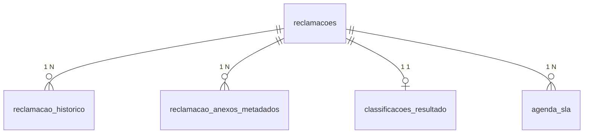

# Modelagem das tabelas (persistência)

Documentação do esquema relacional da aplicação **Gestão de Reclamações**, alinhada à migração Flyway `V1__init_gestao_reclamacoes.sql` e às entidades JPA em `com.banco.reclamacoes.infrastructure.persistence`.

**SGBD alvo:** PostgreSQL (tipos `UUID`, `TIMESTAMP WITH TIME ZONE`, `BIGSERIAL`). Em testes unitários pode ser usado H2 em modo compatível.

---

## Visão geral das relações

- **Núcleo:** `reclamacoes` — uma linha por reclamação oficial (agregado persistido).
- **Dependentes (1:N ou 1:1):** histórico interno, metadados de anexos, resultado detalhado da classificação, linhas opcionais de agenda de SLA — todos referenciam `reclamacoes.id` com `ON DELETE CASCADE`.

---

## Tabela `reclamacoes`

Armazena o estado principal da reclamação: identificadores de negócio, texto, status, dados de classificação (resumo), SLA (instantes), idempotência e auditoria básica.

| Coluna | Tipo | Restrições / notas |
|--------|------|--------------------|
| `id` | `UUID` | PK |
| `solicitacao_id` | `VARCHAR(128)` | `NOT NULL`, **único** (idempotência por solicitação) |
| `protocolo` | `VARCHAR(160)` | `NOT NULL`, **único** |
| `cliente_id` | `VARCHAR(128)` | `NOT NULL`, indexado |
| `canal_origem` | `VARCHAR(32)` | `NOT NULL` |
| `descricao` | `TEXT` | `NOT NULL` |
| `status` | `VARCHAR(32)` | `NOT NULL`, indexado |
| `categoria_principal` | `VARCHAR(96)` | nullable; indexado |
| `confianca_classificacao` | `VARCHAR(16)` | nullable |
| `data_recebimento` | `TIMESTAMPTZ` | `NOT NULL` |
| `deadline_at` | `TIMESTAMPTZ` | `NOT NULL` — fim do prazo SLA |
| `alert_at` | `TIMESTAMPTZ` | `NOT NULL` — instante a partir do qual o alerta é candidato |
| `alerta_emitido` | `BOOLEAN` | `NOT NULL DEFAULT FALSE` |
| `integracao_publicada` | `BOOLEAN` | `NOT NULL DEFAULT FALSE` |
| `correlation_id` | `VARCHAR(160)` | `NOT NULL` |
| `idempotency_key` | `VARCHAR(256)` | `NOT NULL`, **único** |
| `resultado_classificacao_json` | `TEXT` | nullable — cópia/resumo JSON no agregado; detalhe amplo em `classificacoes_resultado` |
| `created_at` | `TIMESTAMPTZ` | `NOT NULL` |
| `updated_at` | `TIMESTAMPTZ` | `NOT NULL` |

**Índices**

- `idx_reclamacoes_cliente` — `(cliente_id)`
- `idx_reclamacoes_status` — `(status)`
- `idx_reclamacoes_categoria` — `(categoria_principal)`
- `idx_reclamacoes_alertas` — `(alert_at)` **parcial:** `WHERE alerta_emitido = FALSE AND status = 'ABERTA'` (suporte a busca de candidatas a alerta)

**Entidade JPA:** `ReclamacaoJpaEntity`

---

## Tabela `reclamacao_historico`

Eventos internos (criação, classificação, SLA, integração, etc.), ordenados pelo tempo.

| Coluna | Tipo | Restrições / notas |
|--------|------|--------------------|
| `id` | `BIGSERIAL` | PK |
| `reclamacao_id` | `UUID` | `NOT NULL`, FK → `reclamacoes(id)` **ON DELETE CASCADE** |
| `tipo` | `VARCHAR(128)` | `NOT NULL` |
| `detalhe` | `TEXT` | `NOT NULL` |
| `ocorrido_em` | `TIMESTAMPTZ` | `NOT NULL` |

**Entidade JPA:** `ReclamacaoHistoricoJpaEntity` (`@ManyToOne` para `ReclamacaoJpaEntity`)

---

## Tabela `reclamacao_anexos_metadados`

Metadados de anexos (referência externa, tipo MIME, atributos em JSON), sem o binário do ficheiro.

| Coluna | Tipo | Restrições / notas |
|--------|------|--------------------|
| `id` | `BIGSERIAL` | PK |
| `reclamacao_id` | `UUID` | `NOT NULL`, FK → `reclamacoes(id)` **ON DELETE CASCADE** |
| `referencia` | `VARCHAR(512)` | `NOT NULL` |
| `tipo_mime` | `VARCHAR(160)` | `NOT NULL` |
| `atributos_json` | `TEXT` | `NOT NULL DEFAULT '{}'` |

**Entidade JPA:** `ReclamacaoAnexoJpaEntity`

---

## Tabela `classificacoes_resultado`

Payload completo do resultado de classificação (estrutura serializada), em relação **1:1** com a reclamação.

| Coluna | Tipo | Restrições / notas |
|--------|------|--------------------|
| `id` | `BIGSERIAL` | PK |
| `reclamacao_id` | `UUID` | `NOT NULL`, **único**, FK → `reclamacoes(id)` **ON DELETE CASCADE** |
| `payload` | `TEXT` | `NOT NULL` |

**Entidade JPA:** `ClassificacaoResultadoJpaEntity` (`@OneToOne` com `ReclamacaoJpaEntity`)

---

## Tabela `agenda_sla`

Registos auxiliares ligados à reclamação (alerta, deadline e flag de processamento). Permite modelar filas ou histórico de janelas de SLA além dos campos desnormalizados em `reclamacoes`.

| Coluna | Tipo | Restrições / notas |
|--------|------|--------------------|
| `id` | `BIGSERIAL` | PK |
| `reclamacao_id` | `UUID` | `NOT NULL`, FK → `reclamacoes(id)` **ON DELETE CASCADE** |
| `alert_at` | `TIMESTAMPTZ` | `NOT NULL` |
| `deadline_at` | `TIMESTAMPTZ` | `NOT NULL` |
| `processado` | `BOOLEAN` | `NOT NULL DEFAULT FALSE` |

**Entidade JPA:** `AgendaSlaJpaEntity` (`@ManyToOne` para `ReclamacaoJpaEntity`)

---

## Evolução do esquema

- Versão inicial aplicada por **Flyway:** `src/main/resources/db/migration/V1__init_gestao_reclamacoes.sql`
- Novas alterações: criar `V2__....sql` (ou versões seguintes) e atualizar este documento.

---

## Mapeamento domínio ↔ persistência

O agregado de domínio `Reclamacao` é montado/desmontado pelo `ReclamacaoMapper` / repositório JPA a partir destas tabelas; eventos de domínio drenados após persistência não ficam numa tabela separada — o histórico equivalente operacional está em `reclamacao_historico`.
